# Arquitetura de MCP Servers — NovaTech Assistant

**Projeto:** db1/novatech-assistant
**Autor:** Tech Lead
**Status:** Vigente
**Última revisão:** 08/07/2026

**Princípio adotado:**
> MCP servers devem ser gerenciados como infraestrutura: versionados, monitorados, com permissões mínimas. O Tech Lead decide quais servers são autorizados e quais tools cada server expõe.

---

## 1. Inventário de MCP Servers Autorizados

| # | Server | Tipo | Tools expostas | Permissões mínimas | Quem consome (papel + ferramenta) |
|---|--------|------|-----------------|---------------------|-------------------------------------|
| 1 | **GitHub** | Público (existente — `github/github-mcp-server`) | `read_code`, `search_code`, `create_pull_request`, `get_pull_request_status` | Token com escopo `repo` restrito a `db1/novatech-assistant` (sem `admin:org`, sem `delete_repo`) | Devs (Claude Code, GitHub Copilot); TL (Claude Code, revisão de PRs) |
| 2 | **Azure AI Search** | Público (existente — Microsoft) | `query_index`, `get_document`, `list_indexes` | Chave de API somente leitura (query key), sem `admin key`; escopo limitado ao índice `novatech-kb` | Devs (Claude Code — testes de recuperação); TL (validação de qualidade de retrieval) |
| 3 | **Azure OpenAI** | Público (existente — Microsoft) | `chat_completion`, `embeddings` | Chave de API restrita ao deployment `gpt-4o-novatech`; sem acesso a outros deployments da subscription | Devs (Claude Code — prototipagem de prompts); TL (avaliação de custo/qualidade) |
| 4 | **Confluence NovaTech** | Público (existente — Atlassian) | `read_page`, `search_pages` | Conta de serviço somente leitura, restrita ao espaço `NOVATECH-ENG` (sem acesso a espaços de RH/Financeiro) | Todos os papéis via Claude (consulta de documentação de negócio/requisitos) |
| 5 | **Azure DevOps** | Público (existente — Microsoft) | `read_work_items`, `create_work_item`, `update_work_item_status` | Token com escopo `Work Items (Read & Write)` apenas no projeto `NovaTech-Assistant`; sem `Code`, sem `Release` | Product Specialist e DM (Claude — abertura/consulta de work items); TL (triagem) |

**Observações de escopo:**
- Nenhum server tem permissão de escrita irrestrita. `create_pull_request` (GitHub) e `create_work_item`/`update_work_item_status` (Azure DevOps) são as únicas tools de escrita autorizadas, e ambas operam em recursos específicos do projeto.
- Não há, hoje, nenhum MCP server **custom** desenvolvido internamente — os 5 são integrações com servers públicos/oficiais dos respectivos fornecedores.
- QA não consome MCP servers diretamente no momento; se isso mudar, precisa passar pela Política de Aprovação (Seção 3).

---

## 2. Diagrama de Conexões

```mermaid
flowchart TB
    subgraph DEV["🖥️ Ambiente de Desenvolvimento Local"]
        Copilot["GitHub Copilot<br/>(Devs, TL)"]
        ClaudeCode["Claude Code<br/>(Devs)"]
    end

    subgraph CICD["⚙️ Ambiente de CI/CD"]
        ContractRunner["Contract Test Runner<br/>(Vitest — service account,<br/>roda em cada PR + job diário)"]
    end

    subgraph GERAL["👥 Uso Geral (Claude — todos os papéis)"]
        ClaudeGeral["Claude<br/>(Devs, QA, PS, TL, DM)"]
    end

    subgraph GH_SRV["GitHub MCP"]
        GH_read["👁️ read_code<br/>👁️ search_code"]
        GH_pr["✍️ create_pull_request"]
        GH_status["👁️ get_pull_request_status"]
    end

    subgraph AIS_SRV["Azure AI Search MCP"]
        AIS_query["👁️ query_index<br/>👁️ get_document<br/>👁️ list_indexes"]
    end

    subgraph AOI_SRV["Azure OpenAI MCP"]
        AOI_call["👁️ chat_completion<br/>👁️ embeddings"]
    end

    subgraph CONF_SRV["Confluence NovaTech MCP"]
        CONF_read["👁️ read_page<br/>👁️ search_pages"]
    end

    subgraph ADO_SRV["Azure DevOps MCP"]
        ADO_read["👁️ read_work_items"]
        ADO_write["✍️ create_work_item<br/>✍️ update_work_item_status"]
    end

    %% Dev local -> servers
    Copilot -->|"read_code, search_code"| GH_read

    ClaudeCode -->|"read_code, search_code"| GH_read
    ClaudeCode -->|"create_pull_request"| GH_pr
    ClaudeCode -->|"query_index, get_document"| AIS_query
    ClaudeCode -->|"chat_completion, embeddings"| AOI_call

    %% CI/CD -> servers (smoke test / contract testing, somente leitura)
    ContractRunner -->|"read_code (smoke)"| GH_read
    ContractRunner -->|"query_index (smoke)"| AIS_query
    ContractRunner -->|"chat_completion (smoke)"| AOI_call
    ContractRunner -->|"read_page (smoke)"| CONF_read
    ContractRunner -->|"read_work_items (smoke)"| ADO_read

    %% Uso geral -> servers
    ClaudeGeral -->|"get_pull_request_status"| GH_status
    ClaudeGeral -->|"search_pages, read_page"| CONF_read
    ClaudeGeral -->|"read_work_items"| ADO_read
    ClaudeGeral -->|"create_work_item, update_work_item_status"| ADO_write

    classDef readonly fill:#e6f4ea,stroke:#2e7d32,color:#1b1b1b
    classDef write fill:#fdecea,stroke:#c62828,color:#1b1b1b,stroke-width:2px
    classDef devEnv fill:#e8eaf6,stroke:#3949ab,color:#1b1b1b
    classDef cicdEnv fill:#fff8e1,stroke:#f9a825,color:#1b1b1b
    classDef generalEnv fill:#ede7f6,stroke:#6a1b9a,color:#1b1b1b

    class GH_read,GH_status,AIS_query,AOI_call,CONF_read,ADO_read readonly
    class GH_pr,ADO_write write
    class Copilot,ClaudeCode devEnv
    class ContractRunner cicdEnv
    class ClaudeGeral generalEnv
```



**Leitura do diagrama:**
- **Ícones**: 👁️ = tool somente leitura, ✍️ = tool de escrita. Nós de escrita aparecem em vermelho (`GH_pr`, `ADO_write`) — visualmente são os únicos pontos do diagrama onde um agente pode alterar estado fora do próprio ambiente local.
- **Ambiente de Desenvolvimento Local** (azul): Copilot e Claude Code, rodando na máquina do dev. Copilot é estritamente leitura. Claude Code é o único agente do ambiente local com uma tool de escrita (`create_pull_request`) — reflete o fluxo onde o dev revisa o diff antes do PR ser criado.
- **Ambiente de CI/CD** (amarelo): o Contract Test Runner (Seção 5) chama os servers **apenas com tools de leitura**, mesmo nos servers que possuem tools de escrita (ex.: ele usa `read_work_items` do Azure DevOps, nunca `create_work_item`). Isso é intencional — testes automatizados não devem criar efeitos colaterais em sistemas de produção/negócio.
- **Uso Geral** (roxo): Claude, usado por todos os papéis fora do fluxo de código, é o único ponto do diagrama com acesso a `create_work_item`/`update_work_item_status` — ou seja, a única superfície de escrita fora do ambiente de dev, e a que mais precisa de atenção em auditoria (Seção 4).
- Servers com **pelo menos uma tool de escrita**: GitHub (via `create_pull_request`) e Azure DevOps (via `create_work_item`/`update_work_item_status`). Azure AI Search, Azure OpenAI e Confluence são 100% somente leitura no inventário atual.

---

## 3. Política de Aprovação

Processo formal para adicionar um novo MCP server ao projeto `novatech-assistant`. O processo tem **duas trilhas**, para não tratar todo pedido com o mesmo peso.

### 3.1 As duas trilhas

| | **Trilha Rápida (Fast-track)** | **Trilha Completa** |
|---|---|---|
| Quando se aplica | Server expõe **apenas tools de leitura** (nenhuma tool que crie, edite, apague ou publique algo) e **não acessa PII, dados financeiros ou credenciais de terceiros** | Server expõe **qualquer tool de escrita** (create/update/delete/publish) **OU** acessa dados sensíveis (PII, financeiro, credenciais), independentemente de ter escrita ou não |
| Quem aprova | Tech Lead (sozinho) | Tech Lead **+** Delivery Manager |
| SLA de aprovação | **até 2 dias úteis** a partir da proposta completa | até 5 dias úteis (pode envolver validação de compliance/contrato com cliente) |
| Documentação exigida | Template simplificado (Seção 3.3, campos 1–5) | Template completo (Seção 3.3, todos os campos) |

A classificação de trilha é feita pelo **proponente**, mas o **Tech Lead confirma a classificação em até 1 dia útil** ao receber a proposta — se o TL entender que uma proposta marcada como "fast-track" na verdade envolve escrita ou dado sensível, ela é reclassificada para Trilha Completa e o SLA reinicia a partir da reclassificação.

**Regra dura, sem exceção:** nenhum dev pode adicionar um MCP server ao `.mcp.json` (mesmo que "só para testar localmente") sem uma proposta aprovada — nem na trilha rápida. O que muda entre trilhas é a velocidade e quem aprova, não se aprovação é necessária.

### 3.2 Quem propõe
Qualquer membro do time (Dev, QA, Product Specialist, DM) pode propor um novo MCP server. A proposta é aberta como **issue no repositório**, usando o template `MCP Server Proposal` (Seção 3.3), com label `mcp-rfc` + label da trilha (`fast-track` ou `full-review`).

### 3.3 Template de MCP Server Proposal

Copiar este template ao abrir a issue (`.github/ISSUE_TEMPLATE/mcp-server-proposal.md`):

```markdown
# MCP Server Proposal: <nome do server>

## Trilha proposta
[ ] Fast-track (somente leitura, sem dados sensíveis)
[ ] Trilha completa (tem escrita e/ou acessa dados sensíveis)

## 1. Identificação
- Nome do server:
- Origem: [ ] Público/oficial  [ ] Comunidade  [ ] Custom interno
- Link do repositório/documentação do server:

## 2. Justificativa
- Problema que resolve:
- Alternativa hoje sem o server (se existir):

## 3. Superfície de tools
Liste TODAS as tools que o server expõe (não só as que você vai usar):
| Tool | Tipo (read/write) | Vamos usar? |
|---|---|---|
| | | |

## 4. Permissões mínimas solicitadas
- Escopo do token/chave necessário:
- Justificativa para cada permissão (por que não um escopo menor?):

## 5. Agentes consumidores
- Quais ferramentas vão usar (Claude Code / Copilot / Claude):
- Por qual papel (Dev / QA / TL / Product Specialist / DM):

---
### Campos abaixo obrigatórios apenas para Trilha Completa

## 6. Dados sensíveis
- O server acessa PII, dados financeiros, dados de clientes ou credenciais? Quais?
- Onde esses dados são armazenados/processados pelo server (região, fornecedor)?

## 7. Escrita e impacto de falha
- O que a tool de escrita faz exatamente (create/update/delete/publish)?
- O que acontece se essa tool for chamada incorretamente ou de forma maliciosa? Existe rollback?

## 8. Plano de monitoramento
- Como saberemos que o server está saudável (ver Seção 4 da arquitetura)?
- Quem será o responsável primário?
```

### 3.4 Quem aprova
- **Trilha Rápida**: aprovação única do **Tech Lead**, registrada como comentário na issue.
- **Trilha Completa**: aprovação do **Tech Lead** (segurança, permissões, impacto arquitetural) **e** do **Delivery Manager** (compliance/contrato com cliente), ambas registradas como comentários na issue. As duas aprovações podem ocorrer em paralelo — não é necessário esperar uma para solicitar a outra.
- Se o TL rejeitar ou pedir ajustes, o proponente revisa o template e reabre a contagem do SLA a partir da resubmissão.
- Sem as aprovações exigidas pela trilha, nenhum server é adicionado ao `.mcp.json`, independentemente de quem propôs.

### 3.5 Onde é registrado
- A decisão (aprovada ou rejeitada, com justificativa) é registrada como comentário de fechamento na issue `mcp-rfc`.
- Servers aprovados são adicionados a este documento (Seção 1 — Inventário) e ao `.mcp.json` versionado no repositório, em um PR separado revisado pelo TL (e pelo DM, se for Trilha Completa).
- Um **registro histórico** de todas as propostas (aprovadas e rejeitadas, das duas trilhas) é mantido na página Confluence `MCP Servers — Histórico de Decisões`, para auditoria futura.

### 3.6 O que fazer se o SLA não for cumprido
Se o Tech Lead não responder dentro do SLA (2 dias fast-track / 5 dias completa), o proponente pode:
1. Marcar o DM na issue como escalonamento.
2. Se ainda assim não houver resposta em +2 dias, tratar como pauta obrigatória na próxima cerimônia semanal do time.

Isso evita que a política vire um bloqueio informal por simples falta de resposta.

---

## 4. Monitoramento

### 4.1 Métricas a coletar por server
| Métrica | Como coletar | Sinal de problema |
|---|---|---|
| Taxa de erro de chamadas (timeout, 4xx, 5xx) | Logs do agente (Claude Code / Claude) ao invocar a tool | > 5% de falhas em janela de 1h |
| Latência de resposta | Timestamp de request/response nos logs do agente | p95 > 3x a latência baseline do server |
| Resultados vazios/inesperados | Amostragem manual periódica das respostas (ex.: `query_index` retornando 0 documentos para queries conhecidas) | Qualquer resposta vazia para queries de smoke test |
| Uso de permissões fora do escopo esperado | Auditoria de logs de acesso do provedor (ex.: Azure AD sign-in logs, GitHub audit log) | Qualquer chamada a uma tool não listada na Seção 1 |

### 4.2 Alertas
- **GitHub / Azure DevOps**: alerta manual — TL revisa semanalmente o audit log em busca de chamadas fora do padrão (ex.: tentativa de uso de tool não autorizada).
- **Azure AI Search / Azure OpenAI**: usar os alertas nativos do Azure Monitor sobre a chave de API do MCP (taxa de erro, throttling), com notificação por e-mail ao responsável do server.
- **Confluence**: sem alerta automatizado no momento (baixo risco, somente leitura); revisão fica a cargo do smoke test manual mensal.
- Qualquer falha detectada — automatizada ou manual — deve gerar um item no Azure DevOps com tag `mcp-incident`.

### 4.3 Responsável por cada server
| Server | Responsável primário | Backup |
|---|---|---|
| GitHub | Tech Lead | Dev sênior designado |
| Azure AI Search | Dev responsável pelo módulo de retrieval | Tech Lead |
| Azure OpenAI | Tech Lead | Dev responsável pelo módulo de prompts |
| Confluence NovaTech | Product Specialist | Tech Lead |
| Azure DevOps | Delivery Manager | Tech Lead |

---

## 5. Estratégia de Versionamento

### 5.1 Contract testing
- Para cada MCP server autorizado, mantemos um conjunto de **testes de contrato** (Vitest) que validam, contra o server real (ou um mock gerado a partir de uma gravação de resposta real), que:
  - As tools listadas na Seção 1 continuam existindo com a mesma assinatura (nomes de parâmetros, tipos).
  - Uma chamada de smoke test conhecida retorna um shape de resposta esperado (schema validado com Zod).
- Esses testes correm no CI **antes de qualquer merge** que toque configuração de MCP, e também em um **job agendado diário**, para detectar mudanças no lado do provedor (não controladas pelo nosso versionamento).

### 5.2 Changelog
- Cada MCP server tem uma entrada em `docs/mcp-changelog.md` no repositório.
- Toda mudança de versão do server (ex.: atualização do endpoint do GitHub MCP, nova versão do connector do Azure DevOps) gera uma entrada com: data, server, versão antiga → nova, tools afetadas, e se houve breaking change.
- Mudanças de terceiros (fora do nosso controle) que impactam contratos são registradas da mesma forma, com a fonte (release notes do fornecedor) linkada.

### 5.3 Processo de depreciação de tools
1. Quando uma tool for marcada como deprecated pelo fornecedor (ou decidirmos não usá-la mais), abrir um item `mcp-deprecation` no Azure DevOps.
2. Buscar no código (`rg` pelo nome da tool) todos os agentes/prompts que a referenciam.
3. Definir uma tool substituta (se houver) e migrar os usos, validando com os testes de contrato.
4. Manter um período de transição de no mínimo 1 sprint com a tool antiga ainda funcional, sinalizando warning nos logs se for chamada.
5. Remover a tool do `.mcp.json` e da Seção 1 deste documento somente após confirmação de que nenhum agente a invoca mais (busca no código + zero chamadas nos logs por 1 sprint).

---

## 6. Configuração de Referência (`.mcp.json`)

```json
{
  "mcpServers": {
    "github": {
      "command": "npx",
      "args": ["-y", "@modelcontextprotocol/server-github"],
      "env": {
        "GITHUB_PERSONAL_ACCESS_TOKEN": "<GITHUB_PAT_SCOPED_TO_REPO>"
      },
      "allowedTools": [
        "read_code",
        "search_code",
        "create_pull_request",
        "get_pull_request_status"
      ]
    },
    "azure-ai-search": {
      "command": "npx",
      "args": ["-y", "@azure/mcp-server-ai-search"],
      "env": {
        "AZURE_SEARCH_ENDPOINT": "https://<seu-servico>.search.windows.net",
        "AZURE_SEARCH_INDEX": "novatech-kb",
        "AZURE_SEARCH_API_KEY": "<QUERY_KEY_READONLY>"
      },
      "allowedTools": [
        "query_index",
        "get_document",
        "list_indexes"
      ]
    },
    "azure-openai": {
      "command": "npx",
      "args": ["-y", "@azure/mcp-server-openai"],
      "env": {
        "AZURE_OPENAI_ENDPOINT": "https://<seu-recurso>.openai.azure.com",
        "AZURE_OPENAI_DEPLOYMENT": "gpt-4o-novatech",
        "AZURE_OPENAI_API_KEY": "<CHAVE_RESTRITA_AO_DEPLOYMENT>",
        "AZURE_OPENAI_API_VERSION": "2024-08-01-preview"
      },
      "allowedTools": [
        "chat_completion",
        "embeddings"
      ]
    },
    "confluence-novatech": {
      "command": "npx",
      "args": ["-y", "@modelcontextprotocol/server-confluence"],
      "env": {
        "CONFLUENCE_BASE_URL": "https://novatech.atlassian.net/wiki",
        "CONFLUENCE_SPACE_KEY": "NOVATECH-ENG",
        "CONFLUENCE_SERVICE_ACCOUNT_EMAIL": "<conta-servico-readonly>@novatech.com",
        "CONFLUENCE_API_TOKEN": "<TOKEN_READONLY>"
      },
      "allowedTools": [
        "read_page",
        "search_pages"
      ]
    },
    "azure-devops": {
      "command": "npx",
      "args": ["-y", "@azure/mcp-server-devops"],
      "env": {
        "AZURE_DEVOPS_ORG": "novatech",
        "AZURE_DEVOPS_PROJECT": "NovaTech-Assistant",
        "AZURE_DEVOPS_PAT": "<PAT_SCOPE_WORKITEMS_READWRITE_ONLY>"
      },
      "allowedTools": [
        "read_work_items",
        "create_work_item",
        "update_work_item_status"
      ]
    }
  }
}
```

**Notas sobre o arquivo de referência:**
- Todos os valores entre `<>` são placeholders — nunca devem ser commitados com valores reais. Usar `.mcp.json` versionado apenas com placeholders, e um `.mcp.local.json` (gitignored) ou variáveis de ambiente do CI/agente para os valores reais.
- O campo `allowedTools` reflete exatamente a lista da Seção 1 — qualquer tool exposta pelo server mas não listada aqui deve ser considerada **não autorizada**, mesmo que o server a suporte tecnicamente.
- Alterações neste arquivo passam pela Política de Aprovação (Seção 3) e pelo fluxo de PR normal do repositório, com revisão obrigatória do Tech Lead.
